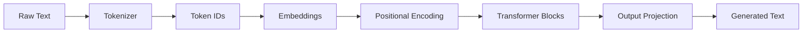

# 🤖 GPT-Style Language Model from Scratch

A complete implementation of a GPT-style transformer language model built from scratch using PyTorch, with training, inference, API deployment, and web interface.

## 🎯 Project Overview

This project demonstrates a full machine learning pipeline for natural language generation:

- **Custom GPT Architecture**: Decoder-only transformer with multi-head attention
- **Training Pipeline**: Complete training loop with checkpointing and monitoring
- **Text Generation**: Multiple sampling strategies (top-k, top-p, temperature)
- **REST API**: FastAPI deployment for programmatic access
- **Web Interface**: Streamlit frontend for user interaction
- **Production Ready**: Modular design with proper error handling

## 🏗️ Architecture



### Model Components
- **Token Embeddings**: Convert token IDs to dense vectors
- **Positional Encoding**: Add position information using sine/cosine
- **Multi-Head Attention**: Learn relationships between tokens
- **Feed-Forward Networks**: Process information at each position
- **Layer Normalization**: Stabilize training
- **Causal Masking**: Ensure autoregressive generation

## 📁 Project Structure

```
llm-project/
├── config.py              # Model and training configuration
├── tokenizer.py           # Text tokenization using HuggingFace
├── model.py               # GPT transformer architecture
├── dataset.py             # Data loading and preprocessing
├── train.py               # Training script with checkpointing
├── generate.py            # Text generation with multiple strategies
├── api.py                 # FastAPI REST API server
├── app.py                 # Streamlit web interface
├── requirements.txt       # Python dependencies
├── data/                  # Training data directory
│   └── sample.txt         # Sample training data
└── saved_models/          # Model checkpoints directory
    └── (generated files)
```

## 🚀 Quick Start

### 1. Installation

```bash
# Clone or create project directory
mkdir llm-project && cd llm-project

# Install dependencies
pip install -r requirements.txt
```

### 2. Prepare Data

Put your text files in the `data/` directory:

```bash
mkdir data
# Add your .txt files to the data/ directory
# Or use the provided sample data
```

### 3. Train the Model

```bash
python train.py
```

Training output:
```
Loading and tokenizing data...
Total parameters: 2,084,864
Training for 10 epochs...
Epoch 1/10 completed - Average loss: 4.2341
Sample generation: The future of artificial intelligence will revolutionize...
```

### 4. Generate Text

```bash
# Interactive mode
python generate.py --interactive

# Single generation
python generate.py --prompt "The future of AI" --temperature 0.8

# Creative writing samples
python generate.py --creative
```

### 5. Start API Server

```bash
python api.py
```

API will be available at:
- **Base URL**: http://localhost:8000
- **Interactive Docs**: http://localhost:8000/docs
- **ReDoc**: http://localhost:8000/redoc

### 6. Launch Web Interface

```bash
streamlit run app.py
```

Web interface will open in your browser at http://localhost:8501

## 🔧 Configuration

Edit `config.py` to customize model architecture and training:

```python
class ModelConfig:
    # Model Architecture
    vocab_size = 5000           # Vocabulary size
    max_length = 256           # Maximum sequence length
    n_layers = 2               # Number of transformer layers
    n_heads = 4                # Number of attention heads
    d_model = 256              # Model dimension
    
    # Training
    batch_size = 8             # Batch size
    learning_rate = 3e-4       # Learning rate
    num_epochs = 10            # Training epochs
```

## 📊 Model Architecture Details

### Transformer Block
```python
class TransformerBlock(nn.Module):
    def forward(self, x, mask=None):
        # Pre-norm multi-head attention
        attn_output = self.attention(self.ln1(x), mask)
        x = x + self.dropout(attn_output)
        
        # Pre-norm feed-forward
        ff_output = self.feed_forward(self.ln2(x))
        x = x + self.dropout(ff_output)
        return x
```

### Generation Strategies
- **Temperature Sampling**: Controls randomness (0.1 = conservative, 1.5 = creative)
- **Top-K Sampling**: Only consider top K most likely tokens
- **Top-P (Nucleus) Sampling**: Dynamic vocabulary based on cumulative probability
- **Combined Sampling**: Use all strategies together for best results

## 🌐 API Usage

### Generate Text
```bash
curl -X POST "http://localhost:8000/generate" \
     -H "Content-Type: application/json" \
     -d '{
       "prompt": "The future of artificial intelligence",
       "max_length": 100,
       "temperature": 0.8,
       "top_k": 50,
       "top_p": 0.9
     }'
```

### Batch Generation
```bash
curl -X POST "http://localhost:8000/generate/batch" \
     -H "Content-Type: application/json" \
     -d '{
       "prompts": ["Story 1 beginning", "Story 2 beginning"],
       "max_length": 80,
       "temperature": 0.9
     }'
```

### Python Client
```python
import requests

response = requests.post("http://localhost:8000/generate", json={
    "prompt": "Once upon a time",
    "max_length": 100,
    "temperature": 0.8
})

result = response.json()
print(result["generated_text"])
```

## 🎨 Web Interface Features

- **Interactive Generation**: Real-time text generation with parameter control
- **Preset Prompts**: Quick-start templates for different scenarios
- **Generation History**: Track and export all generations
- **Batch Processing**: Generate multiple texts simultaneously
- **Statistics Dashboard**: Monitor performance and generation patterns
- **Export Functionality**: Download generated texts and history

## 🔍 Training Monitoring

The training script provides comprehensive monitoring:

```
Step 0, loss: 8.5432
Step 20, loss: 6.2341
Step 40, loss: 4.8765

Sample generation: The future of artificial intelligence will transform

Epoch 1/10 completed
Average loss: 4.2341
Best loss: 4.2341
Time elapsed: 45.67s
Learning rate: 3.00e-04
```

## 📈 Performance Optimization

### Training Speed
- **Gradient Clipping**: Prevents exploding gradients
- **Learning Rate Scheduling**: Cosine annealing for better convergence
- **Mixed Precision**: Use `torch.cuda.amp` for faster training (optional)
- **Batch Size**: Adjust based on available GPU memory

### Generation Speed
- **Top-K/Top-P**: Reduce vocabulary for faster sampling
- **Caching**: Reuse key-value computations (advanced)
- **Quantization**: Use int8 for inference (advanced)

## 🛠️ Customization

### Add Your Own Data
1. Place `.txt` files in the `data/` directory
2. Run `python train.py` to retrain on your data
3. Larger datasets will produce better results

### Modify Architecture
- Change `n_layers` for deeper/shallower models
- Adjust `d_model` for wider/narrower models
- Modify `n_heads` for different attention patterns

### Custom Tokenization
- Replace tokenizer in `tokenizer.py`
- Ensure vocabulary size matches model configuration
- Retrain model with new tokenizer

## 🚀 Deployment

### Local Development
```bash
# Terminal 1: API Server
python api.py

# Terminal 2: Web Interface
streamlit run app.py
```

### Production Deployment
```bash
# Use production WSGI server
pip install gunicorn
gunicorn api:app -w 4 -k uvicorn.workers.UvicornWorker

# Docker deployment (create Dockerfile)
FROM python:3.9
COPY . /app
WORKDIR /app
RUN pip install -r requirements.txt
CMD ["python", "api.py"]
```

## 📝 Example Outputs

**Creative Writing**:
```
Prompt: "In a world where dreams become reality"
Generated: "In a world where dreams become reality, Sarah discovered that her childhood fantasy of flying was now her greatest challenge. The city skyline stretched beneath her as she soared through clouds that felt like cotton candy..."
```

**Technical Writing**:
```
Prompt: "Machine learning algorithms"
Generated: "Machine learning algorithms have revolutionized data analysis by enabling computers to identify patterns without explicit programming. These sophisticated systems learn from training data..."
```

## ⚡ Troubleshooting

### Common Issues

**CUDA Out of Memory**:
```python
# Reduce batch size in config.py
batch_size = 4  # Instead of 8
```

**Slow Training**:
```python
# Reduce model size
n_layers = 1    # Instead of 2
d_model = 128   # Instead of 256
```

**API Connection Failed**:
```bash
# Check if API server is running
curl http://localhost:8000/health
```

**Poor Generation Quality**:
- Train for more epochs
- Use more/better training data
- Adjust temperature (0.7-0.9 usually works well)

## 🎓 Learning Outcomes

This project demonstrates:

1. **Deep Learning**: Transformer architecture, attention mechanisms
2. **PyTorch**: Model building, training loops, optimization
3. **NLP**: Tokenization, language modeling, text generation
4. **Software Engineering**: Modular design, error handling, testing
5. **Web Development**: REST APIs, web interfaces, deployment
6. **MLOps**: Model versioning, monitoring, production deployment

## 📚 Technical References

- [Attention Is All You Need](https://arxiv.org/abs/1706.03762) - Original Transformer paper
- [GPT-1](https://cdn.openai.com/research-covers/language-unsupervised/language_understanding_paper.pdf) - First GPT paper
- [GPT-2](https://cdn.openai.com/better-language-models/language_models_are_unsupervised_multitask_learners.pdf) - Scaling language models
- [PyTorch Transformer Tutorial](https://pytorch.org/tutorials/beginner/transformer_tutorial.html)

## 🤝 Contributing

1. Fork the repository
2. Create feature branch: `git checkout -b feature-name`
3. Commit changes: `git commit -am 'Add feature'`
4. Push to branch: `git push origin feature-name`
5. Submit pull request

## 📄 License

This project is open source and available under the MIT License.

---

**Built with ❤️ for learning and experimentation**
